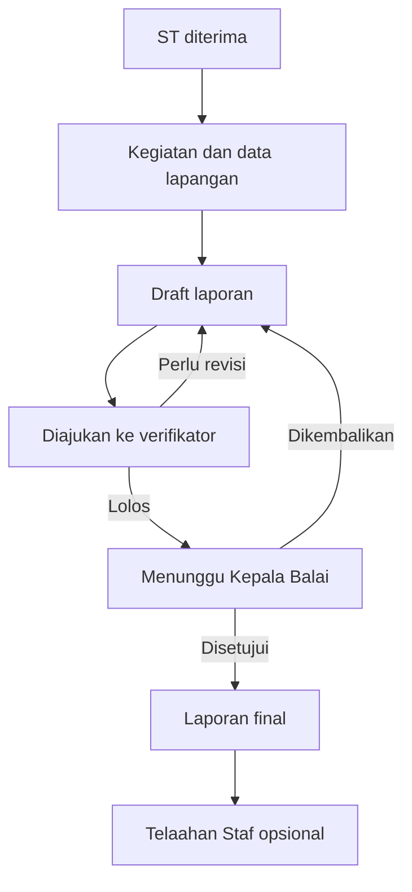

# Blueprint SI-PD BPHL Wilayah XI Banjarbaru — versi 2.0

**Status:** rancangan produk untuk implementasi bertahap; diperbarui 25 September 2026  
**Pengguna dokumen:** pemilik proses BPHL XI dan Antigravity sebagai pelaksana pengembangan  
**Tujuan:** memfasilitasi pekerjaan staf sejak Surat Tugas (ST), pengumpulan dan analisis data, penyusunan laporan, koreksi berjenjang, persetujuan Kepala Balai, sampai Telaahan Staf bila diperlukan.

> Dokumen ini adalah spesifikasi rancangan, bukan pernyataan bahwa aplikasi yang ada telah memenuhi seluruh persyaratan. Contoh instrumen harus divalidasi pemilik proses sebelum dipakai sebagai instrumen resmi. Dasar hukum pada berkas sumber belum diverifikasi keberlakuannya.

## 1. Keputusan produk dan batas V1

1. **Kegiatan** adalah entitas induk. Satu kegiatan merujuk ke ST, tim, objek, data lapangan, analisis, lampiran, dan satu atau lebih dokumen yang berasal dari data tersebut.
2. **Laporan** adalah dokumen hasil kegiatan. Teks template berbeda menurut jenis kegiatan, sementara kerangka, proses verifikasi, dan mesin penyusunan tetap sama.
3. **Telaahan Staf** opsional dan hanya dapat dibuat dari **versi laporan yang sudah disetujui Kepala Balai**. Perubahan pada laporan yang telah disetujui memerlukan versi baru dan persetujuan ulang; telaahan lama tetap menunjuk versi sumber yang semula.
4. AI membantu merumuskan naskah dari data yang diberikan staf. AI tidak boleh menciptakan angka, fakta, temuan, dasar hukum, atau status pembayaran. Staf bertanggung jawab memeriksa naskah.
5. Persetujuan pada aplikasi dicatat sebagai tindakan pengguna yang terautentikasi. **QR biasa bukan tanda tangan elektronik tersertifikasi**. Penerapan TTE/QR untuk dokumen resmi memerlukan kebijakan tata naskah, layanan penandatanganan yang sah, dan keputusan instansi tersendiri. V1 cukup menampilkan status serta jejak persetujuan; jangan memberi label “ditandatangani” jika hanya approval internal.
6. V1 mencakup alur kegiatan, laporan, koreksi, persetujuan, arsip, dan pembuatan telaahan opsional. Penyusunan ST resmi, tanda tangan eksternal, disposisi, penagihan PNBP, dan monitoring tindak lanjut lintas unit adalah perluasan berikutnya.

## 2. Sumber dan asumsi

| Bahan | Pemakaian | Keterbatasan |
|---|---|---|
| `Data Perjalanan Dinas PEPHPHL - Sheet1.pdf` | Katalog awal 17 jenis kegiatan: tujuan, metode, dasar hukum yang dicantumkan, dan data yang perlu dijelaskan | Beberapa sel sangat panjang; nomenklatur dan ketentuan wajib harus dikonfirmasi pemilik proses. |
| `LPD_BPHL_XI_20260619_Mengevaluasi_dan_mem.pdf` | Contoh artefak laporan yang disampaikan pengguna dan alur Lia Yunita dalam percakapan | PDF berbasis gambar; isi lengkap dan bentuk tata naskahnya perlu transkripsi/verifikasi sebelum dijadikan templat final. |
| `Teks yang ditempel (1)(20260925-061636).txt` | Catatan audit teknis 27 Agustus 2026; sumber pemeriksaan terhadap kode terbaru | Temuan audit bersifat historis, tidak membuktikan kondisi source September. |
| Penjelasan pemilik proses | Staf → Kepala Seksi/Kasubag TU → Kepala Balai; laporan disetujui sebelum Telaahan Staf | Penetapan verifikator per jenis kegiatan dan kewenangan telaahan perlu keputusan organisasi. |

## 3. Peran dan kewenangan

| Aksi | Staf pembuat | Verifikator yang ditugaskan | Kepala Balai / validator | Admin |
|---|---:|---:|---:|---:|
| Buat kegiatan dan edit draft miliknya | Ya | Tidak | Tidak | Konfigurasi saja |
| Isi data, lampirkan bukti, susun laporan | Ya | Tidak | Tidak | Tidak |
| Lihat laporan yang menjadi tugasnya | Ya | Ya | Ya | Akses dukungan terbatas dan tercatat |
| Beri catatan dan kembalikan ke staf | Tidak | Ya | Ya | Tidak |
| Nyatakan lolos verifikasi dan ajukan ke Kepala Balai | Tidak | Ya | Tidak | Tidak |
| Setujui laporan atau kembalikan | Tidak | Tidak | Ya | Tidak |
| Buat Telaahan Staf dari laporan disetujui | Ya, jika berwenang pada kegiatan | Sesuai penugasan | Lihat | Tidak |
| Kelola pengguna, template, dasar hukum, master objek | Tidak | Tidak | Tidak | Ya |

Izin harus ditegakkan di server pada setiap operasi, termasuk pembacaan file dan ekspor. Akun bisa memiliki lebih dari satu peran, tetapi setiap aksi mencatat peran dan kewenangan yang digunakan. Verifikator ditentukan melalui penugasan pada kegiatan, bukan semata jabatan global. Ketika pembuat dan pejabat pemeriksa adalah orang yang sama, sistem memerlukan pemeriksa pengganti yang berwenang; tidak boleh memverifikasi laporan sendiri.

## 4. Alur kerja dan status

**Status kegiatan** `DRAFT`, `BERJALAN`, `MENUNGGU_LAPORAN`, `SELESAI`, `DIBATALKAN`. Status ini menggambarkan pekerjaan, bukan menyalin status dokumen.

**Status laporan** `DRAFT` → `DIAJUKAN_VERIFIKASI` → (`PERLU_REVISI` → `DRAFT` → `DIAJUKAN_VERIFIKASI`)* → `TERVERIFIKASI` → `MENUNGGU_VALIDASI` → (`DIKEMBALIKAN_VALIDATOR` → `DRAFT` → verifikasi ulang)* → `DISETUJUI`. `DIBATALKAN` hanya lewat tindakan berwenang dengan alasan tercatat; bukan penghapusan fisik. Status `TERVERIFIKASI` dapat langsung bertransisi ke `MENUNGGU_VALIDASI` dalam satu transaksi server, tetapi kedua peristiwa tercatat. Tidak ada status `FINAL` terpisah bila hanya menduplikasi `DISETUJUI`.

**Aturan transisi:**

- Pengajuan membuat snapshot versi yang tidak dapat diedit. Revisi menghasilkan versi berikutnya, menyimpan versi dan komentar sebelumnya. Catatan pemeriksaan menunjuk versi dan, bila memungkinkan, bagian/paragraf spesifik.
- Hanya verifikator tertugas dapat meloloskan versi terbaru; hanya Kepala Balai berwenang dapat menyetujui versi yang telah diverifikasi.
- Validator boleh mengembalikan dengan alasan, kemudian verifikasi ulang diperlukan. Sistem mengirim pemberitahuan kepada pembuat dan pemeriksa terkait.
- Persetujuan menyimpan identitas, jabatan saat bertindak, waktu server, versi laporan, dan checksum konten. Pembatalan persetujuan memerlukan proses koreksi berwenang dengan audit trail; tidak mengubah diam-diam versi disetujui.
- Telaahan hanya bisa dibuat jika `report.status == DISETUJUI`, sumbernya versi yang disetujui, dan staf punya akses. Cek dilakukan di UI **dan server** pada saat create. Telaahan memiliki draft dan riwayat tersendiri; alur pengesahannya **belum diputuskan** dan tidak boleh diasumsikan sama dengan laporan.

## 5. Pengalaman pengguna dan layar

| Layar | Isi dan tindakan pokok |
|---|---|
| Login dan profil | Masuk akun organisasi, peran aktif, identitas dan riwayat sesi. |
| Dashboard staf | Draft, revisi, menunggu pemeriksaan, disetujui; daftar tugas dan tindakan berikutnya. |
| Dashboard verifikator | Antrean yang ditugaskan, tenggat, detail versi, komentar, kembalikan/loloskan. |
| Dashboard Kepala Balai | Antrean yang telah diverifikasi, ringkasan data/bukti, versi dan catatan verifikator, setujui/kembalikan. |
| Daftar kegiatan | Pencarian ST, jenis, objek, staf, tanggal dan status; hanya sesuai cakupan akses. |
| Wizard kegiatan | 1 Identitas/ST; 2 tim dan penugasan; 3 instrumen lapangan; 4 hasil dan analisis; 5 dokumentasi; 6 susun laporan; 7 preview dan ajukan. Auto-save draft dan validasi setiap tahap. |
| Detail kegiatan | Fakta, lampiran, dokumen, riwayat, versi, catatan, dan tindakan yang diizinkan. |
| Editor laporan | Bagian terstruktur, asal tiap data, edit narasi, preview A4, peringatan kekosongan dan inkonsistensi. |
| Telaahan Staf | Tombol hanya pada laporan yang disetujui; tampilkan laporan sumber dan versinya, editor tujuh bagian, simpan dan ekspor draft. |
| Admin | Pegawai/peran, penugasan pemeriksa, jenis kegiatan, versi template, instrumen, dasar hukum, objek kegiatan, pengaturan keluaran. |

Wizard dapat dikerjakan tidak berurutan setelah identitas minimum dibuat. Pengguna dapat menyimpan kekosongan sebagai draft; syarat kelengkapan diperiksa saat pengajuan. Tampilan seluler harus mendukung pengisian dan unggah bukti di lapangan; offline penuh berada di luar V1.

## 6. Data inti dan hubungan

| Entitas | Field minimum dan relasi |
|---|---|
| `users`, `roles`, `user_roles` | Identitas pegawai, NIP, jabatan, unit, status; akun bukan sekadar NIP; peran jamak. |
| `assignments` | ST nomor/tanggal, file ST, pemberi tugas, periode, versi/referensi dokumen; satu ST bisa terkait beberapa kegiatan hanya bila proses bisnis mengizinkan. |
| `activities` | ID, tipe dan versi template, ST, objek, lokasi, tanggal, pembuat, status. |
| `activity_members`, `reviewer_assignments` | Tim, peran pada kegiatan, verifikator tertugas, rentang penugasan. |
| `subject_entities` | PBPH/PBPHH/KPH atau objek lain, identitas dan jenis, snapshot nama pada kegiatan. |
| `activity_data` | Jawaban instrumen berbasis skema berversi, sumber, waktu, pembuat; tabel pengukuran berulang disimpan sebagai baris terkait. |
| `findings` | Catatan/temuan, dasar bukti, analisis, rekomendasi; opsional pada V1, tanpa workflow tindak lanjut kompleks. |
| `attachments` | Metadata file, tipe, ukuran, hash bila tersedia, penyimpan, relasi kegiatan, caption, `provider`, `file_id`, URL referensi opsional, status akses; file bukan Base64 dalam database. |
| `report_versions` | Nomor versi, snapshot semua bagian teks/data/template, pembuat, waktu, hash, status. |
| `review_comments`, `approval_events`, `audit_events` | Target versi/bagian, isi catatan, tindakan, aktor, waktu server, alasan; append-only. |
| `staff_studies`, `staff_study_versions` | Referensi `approved_report_version_id`, isi telaahan, pembuat, versi, status draft. |
| `activity_templates`, `template_versions`, `instrument_fields` | Struktur bagian, aturan field, teks default, validasi, kategori, tanggal berlaku, status terbit. |
| `legal_references`, `template_legal_references` | Identitas peraturan, ruang lingkup, status telaah, versi/masa berlaku, relasi ke template. |

Gunakan identifier internal stabil, foreign key, dan transaksi. Hindari menjadikan nomor urut spreadsheet sebagai kunci bisnis. Simpan snapshot nama objek, dasar hukum yang dipilih, dan template pada versi laporan agar perubahan master tidak mengubah dokumen historis. Aturan retensi, lokasi server, dan klasifikasi data diputuskan BPHL sebelum operasional.

## 7. Mesin template kegiatan

Setiap **versi template** menyimpan: nama/kode jenis kegiatan, kategori, status `DRAFT`/`PUBLISHED`/`RETIRED`, urutan bagian, teks petunjuk dan default yang dapat diedit, instrumen field beserta tipe/opsi/validasi, aturan kelengkapan, contoh keluaran, serta relasi dasar hukum. Penerbitan versi baru tidak mengubah kegiatan yang sedang berjalan; migrasi kegiatan dilakukan secara eksplisit.

**Jenis isi:** (a) data sistem: ST, tim, lokasi, tanggal; (b) petunjuk/default template: tujuan, metode, kerangka pendahuluan dan dasar pelaksanaan yang tetap dapat disesuaikan; (c) data substantif: pemeriksaan, analisis, temuan dan rekomendasi yang diisi staf. Dasar hukum harus dipilih dan ditelaah manusia; jangan memasukkan daftar lama otomatis ke laporan final.

**Tipe field V1:** teks singkat/panjang, angka dengan satuan, tanggal, pilihan, pilihan jamak, ya/tidak/tidak berlaku, tabel baris berulang, file, foto dengan caption, referensi objek/dokumen. Setiap field punya label, petunjuk, wajib atau bersyarat, rentang nilai bila relevan, dan kelompok pembahasan. Tabel kompleks menggunakan komponen terversi, bukan editor JSON bebas untuk admin biasa. Preview template dengan data contoh dan persetujuan pengelola sebelum terbit.

**Katalog awal dari dokumen 17 kegiatan:**

| No | Jenis kegiatan | Keluarga rancangan awal |
|---:|---|---|
| 1 | Fasilitasi Penilaian KPH Efektif | Penilaian/fasilitasi |
| 2 | Evaluasi Kinerja PBPH | Evaluasi kepatuhan |
| 3 | Monitoring dan Evaluasi Rencana Penebangan pada PBPH/PKKNK/PPPS | Teknis lapangan |
| 4 | Pengawasan dan Pengendalian Penerapan Sistem Silvikultur | Teknis lapangan |
| 5 | Peningkatan Produksi HHBK pada PBPH/PPPS | Pembinaan usaha |
| 6 | Monitoring dan Evaluasi Implementasi MUK | Teknis lapangan |
| 7 | Monitoring dan Evaluasi Penanaman pada PBPH | Teknis lapangan |
| 8 | Monitoring dan Evaluasi Pengelolaan Kawasan Lindung | Teknis lapangan |
| 9 | Pengendalian, Monitoring dan Evaluasi Tenaga Teknis | SDM teknis |
| 10 | Workshop Peraturan Terbaru Bidang Kehutanan | Kegiatan pertemuan |
| 11 | Monitoring dan Evaluasi Pemenuhan Kewajiban PUHH dan PNBP pada PBPH/PPPS/PKKNK | Evaluasi kepatuhan |
| 12 | Monitoring dan Evaluasi Implementasi SVLK pada PBPHH | Evaluasi kepatuhan |
| 13 | Pengendalian, Monitoring dan Evaluasi Kinerja PBPHH | Evaluasi kepatuhan |
| 14 | Pengarusutamaan Hilirisasi Produk Hasil Hutan untuk Industri Kehutanan | Pembinaan usaha |
| 15 | Bimbingan Teknis Penyusunan dan Pelaporan RKOPHH | Kegiatan pertemuan |
| 16 | Pemantauan & Verifikasi Pembayaran PNBP Kehutanan | Pemeriksaan PNBP |
| 17 | Sosialisasi Sertifikasi SVLK Kehutanan | Kegiatan pertemuan |

Pengelompokan di kolom terakhir adalah keputusan desain awal, bukan klasifikasi resmi. Jangan menganggap 17 instrumen telah selesai dirinci. Mulai dengan template pilot nomor 16 dan nomor 11, kemudian validasi perbedaan keduanya sebelum memperluas katalog.

### Pilot instrumen nomor 16: Pemantauan & Verifikasi Pembayaran PNBP

- Identitas objek/izin dan dokumen yang diperiksa, periode pemeriksaan, sumber serta tanggal pengambilan data.
- Baris pemeriksaan LHP dan realisasi pada SIPNBP, identitas billing/bukti pembayaran, jenis kewajiban PSDH/DR **jika berlaku**, jumlah terutang/terbayar menurut sumber, tanggal, status hasil rekonsiliasi.
- Sampling fisik: identitas sampel, panjang/diameter dokumen dan hasil ukur, satuan, selisih; rumus dan toleransi tidak boleh ditebak sistem dan harus dikonfigurasi dari instrumen resmi yang disahkan.
- Bukti, hambatan, penjelasan pihak terkait, analisis staf, simpulan dan rekomendasi. Status `tidak tersedia` dibedakan dari `nol`, `tidak berlaku`, serta `belum lunas`.
- Ringkasan tujuan/metode pada dokumen sumber dapat menjadi teks awal **setelah** pemeriksaan dasar hukum dan penyesuaian pada ST aktual.

### Contoh instrumen nomor 7: Penanaman

Kelompok persemaian (jumlah, jenis, koordinat, luas, kapasitas), realisasi per tahun, rencana per tahun, kesesuaian terhadap dokumen perencanaan, bukti pengamatan dan kendala. Tahun tidak di-hard-code; ditentukan sesuai periode kegiatan dan dokumen rencana.

### Contoh instrumen nomor 4: Silvikultur

Sistem yang diterapkan, tahapan dan lokasi, dokumen rencana, bukti pelaksanaan per tahapan, ketidaksesuaian dan analisis. Detail parameter teknis wajib disepakati bersama pejabat substansi sebelum diterbitkan.

## 8. Penyusunan laporan, AI, dan keluaran

Kerangka awal: identitas/judul; pendahuluan; dasar pelaksanaan; waktu/tempat; sasaran; pelaksana; maksud dan tujuan; metode; hasil/pembahasan menurut kelompok instrumen; kesimpulan; saran/tindak lanjut; dokumentasi/lampiran. Template dapat menyembunyikan, mengganti label, atau menambah subbagian berdasarkan jenis kegiatan. Fakta di editor dapat ditelusuri ke jawaban dan bukti sumber.

AI menerima **snapshot data yang dipilih staf**, nama bagian, template versi, dan instruksi tidak menambah fakta. AI mengembalikan draft disertai rujukan field sumber dan daftar fakta yang belum cukup; tanpa bukti, tulis “perlu dilengkapi”, bukan mengisi tebakan. Staf dapat membandingkan sebelum/sesudah, menerima/edit/menolak, dan jejak penggunaan AI dicatat. Kegagalan layanan AI tidak boleh menghasilkan narasi seolah faktual; editor manual selalu tersedia. Jangan mengirim data rahasia atau pribadi ke penyedia AI sebelum pengaturan keamanan data dan kebijakan instansi disahkan.

Ekspor PDF A4 menjadi kebutuhan penerimaan V1; ekspor DOCX editable jika mutu tata letak telah diuji pada contoh nyata. Dokumen keluaran menyebut nomor/versi dan waktu persetujuan dalam metadata/lembar informasi sesuai keputusan tata naskah. Pratinjau dan berkas hasil ekspor harus memakai snapshot versi yang sama. Telaahan Staf memiliki tujuh bagian awal: judul, persoalan, praanggapan, fakta, analisis, kesimpulan, saran; semua dapat diedit dan wajib memisahkan fakta sumber dari penilaian staf.

## 9. Arsitektur dan kontrol minimum

- Satu backend dan database transaksional menjadi sumber kebenaran. Browser hanya menyimpan cache dan draft sementara yang aman; tidak boleh mengirim seluruh database sebagai overwrite. Pilihan PostgreSQL cocok untuk penggunaan multiuser; pemilihan stack final mengikuti lingkungan hosting yang nyata.
- Login nyata dengan session aman, hash kata sandi atau SSO organisasi, otorisasi server per objek/per aksi, validasi input, pembatasan unggah, perlindungan sesi, dan pengujian akses lintas peran. Jangan menyediakan role switcher bypass di produksi.
- Simpan berkas di penyimpanan eksternal yang dikelola organisasi dengan akses terkontrol; database aplikasi hanya metadata dan referensi stabil. Buat batas ukuran/tipe, pemeriksaan berkas, backup, dan pemulihan. Rincian keputusan Drive dan pengamanan ada pada bagian 9A.
- Mutasi status memakai transaksi, optimistic concurrency/version check untuk mencegah dua peninjau menimpa keputusan; audit event append-only. Waktu dicatat UTC dan ditampilkan WITA bagi pengguna.
- Audit Agustus melaporkan localStorage + `db_store.json`, endpoint tanpa otorisasi server, password plaintext, dan foto Base64. **Periksa kode terkini** sebelum menyatakan temuan itu masih ada; semua kondisi tersebut wajib ditutup sebelum pilot multiuser dengan data nyata.
- Buat migrasi terkontrol: inventaris data lama, mapping ke model baru, dry run, pemeriksaan jumlah/relasi/hash, backup, rollback, dan tanda untuk field yang tak dapat dipetakan. Jangan menimpa arsip historis.

### 9A. Penyimpanan foto, video, dan lampiran di luar aplikasi

**Keputusan desain:** aplikasi menyimpan *referensi dan metadata*, bukan berkas mentah. Penyimpanan terpisah mengurangi ukuran database dan beban backup database, tetapi unggah, pratinjau, dan unduh tetap memakai bandwidth serta kuota penyimpanan. Memindahkan berkas ke Drive tidak dengan sendirinya membuat aplikasi aman atau cepat.

**Pilihan awal untuk pilot:** Google Workspace **Shared Drive milik organisasi**, jika tersedia dan disetujui pengelola TI instansi. Jangan memakai My Drive pribadi staf sebagai tempat arsip utama: kepemilikan dan keberlanjutan dokumen lebih sulit dikendalikan ketika pegawai pindah. Google menjelaskan bahwa berkas di Shared Drive tetap ada ketika anggota keluar. Jika Shared Drive atau kebijakan data instansi tidak memungkinkan, gunakan layanan penyimpanan organisasi yang memenuhi persyaratan akses dan retensi yang sama. Pilihan vendor final menunggu pemeriksaan pengelola TI.

**Dua pola integrasi yang berbeda:**

| Pola | Cara kerja | Batasan keamanan |
|---|---|---|
| A. Referensi manual untuk pilot | Staf unggah lewat akun organisasi ke Shared Drive lalu menempel tautan/ID file; aplikasi mencatat metadata dan memeriksa bahwa tautan berasal dari domain dan drive yang diizinkan. | Aplikasi tidak dapat menjamin berkas tetap ada, benar, atau aksesnya sesuai; petugas harus memeriksa izin dan membuka tautan saat verifikasi. Jangan izinkan URL acak sebagai pratinjau otomatis. |
| B. Integrasi terkelola untuk produksi | Unggah dari aplikasi melalui alur resmi Drive API/OAuth berizin terbatas; backend mengaitkan `file_id` dengan kegiatan dan memeriksa kepemilikan/lokasi/izin. | Memerlukan pengaturan identitas, izin API, kebijakan token, kuota dan pengujian. Backend tidak boleh menyimpan kredensial pengguna dalam browser atau mengandalkan ID file sebagai bukti hak akses. |

**Aturan akses wajib:**

1. Setelan file/folder adalah **Dibatasi**; jangan gunakan “Siapa saja yang memiliki link” untuk bukti kegiatan. Mengetahui link atau ID file tidak boleh berarti boleh melihat berkas. Google menyatakan mode “siapa saja yang memiliki link” dapat dibuka tanpa login.
2. Tetapkan grup/anggota Shared Drive atau folder terbatas sesuai cakupan kegiatan. Pengguna yang boleh melihat laporan di SI-PD belum otomatis boleh melihat file di Drive, dan sebaliknya. Kebijakan Drive harus konsisten dengan RBAC aplikasi; akses Drive langsung di luar aplikasi tidak bisa dicegah oleh login SI-PD.
3. Saat menampilkan atau mengunduh lampiran, server memeriksa hak pengguna pada kegiatan dan identitas file terkait. Jika akses Drive dikelola terpisah, Drive juga harus menolak pengguna yang tidak berhak; jangan menerbitkan link publik sebagai jalan pintas pratinjau. Berikan kesalahan akses yang jelas dan catat kejadian.
4. Jangan memasukkan tautan publik, token akses, atau URL yang mengandung kredensial ke laporan, log, prompt AI, maupun notifikasi. Gunakan `provider + file_id` sebagai referensi utama; URL hanya dibuat saat perlu dan sesuai izin. Bersihkan nama file/caption dan validasi jenis serta ukuran unggahan.
5. Batasi pengaturan berbagi eksternal dan hak mengunduh sesuai kebijakan instansi; tinjau keanggotaan berkala, aktifkan MFA pada akun terkait, catat perubahan izin dan akses, serta siapkan pemulihan berkas terhapus. Pembatasan download tidak dapat mencegah seseorang memotret layar atau menyebarkan berkas yang sudah diterima.
6. Pisahkan hak pengunggah dari hak pengelola izin/hapus. Tentukan apakah bukti pada laporan yang sudah disetujui harus dibekukan atau diarsipkan terpisah; jika file sumber dapat diganti, simpan `file_id`, ukuran dan hash bila didapat untuk mendeteksi perubahan.

**Ancaman bypass yang harus diuji:** pengguna tanpa hak menebak/mendapat ID file, membuka tautan Drive langsung, menukar `attachment_id` pada API, menempel link ke file milik orang lain, mengubah izin menjadi publik, dan menghapus atau mengganti file setelah laporan disetujui. Akses yang gagal di aplikasi tetapi berhasil melalui link Drive berarti konfigurasi berbagi perlu diperbaiki. Keamanan aplikasi dan keamanan Drive adalah dua lapisan terpisah yang sama-sama wajib benar.

**Kriteria penerimaan tambahan:** file privat gagal dibuka lewat sesi penyamaran atau akun di luar grup; staf yang tak ditugaskan tidak dapat membuka lampiran melalui API SI-PD ataupun Drive; perubahan izin/file terdeteksi saat pemeriksaan; pengunggahan video besar tidak masuk ke database atau payload laporan; kegagalan Drive tidak menghilangkan draft metadata dan dapat dicoba ulang dengan aman.

## 10. Urutan implementasi untuk Antigravity

| Tahap | Hasil yang harus bisa diperiksa |
|---|---|
| 0. Audit source terbaru | Daftar arsitektur saat ini, fitur yang dapat dipakai ulang, celah terhadap blueprint, rencana migrasi data. Tidak mengasumsikan audit lama masih tepat. |
| 1. Kontrak domain | Model data, state machine, matriks akses, skema versi template dan contoh data pilot; tinjauan pemilik proses. |
| 2. Fondasi | Database, autentikasi, izin server, storage lampiran, audit event, backup dan migrasi. |
| 3. Alur inti | ST/kegiatan/tim, instrumen pilot, editor laporan, versi, catatan revisi, verifikasi, persetujuan. |
| 4. Dokumen dan telaahan | Preview/ekspor laporan versi disetujui; pembuatan telaahan hanya dari sumber disetujui. |
| 5. Pengelolaan template | Publish versi, preview instrumen, katalog 17 jenis secara bertahap setelah validasi ahli. |
| 6. AI terbatas dan pilot | Draft berbasis fakta dengan jejak sumber; uji beberapa staf, verifikator, dan Kepala Balai menggunakan kegiatan contoh. |

**Kriteria penerimaan pilot:** dua staf dapat mengerjakan kegiatan berbeda bersamaan tanpa kehilangan data; pengguna tidak dapat membaca/mengubah laporan di luar penugasan; pengajuan membekukan versi; komentar revisi dan semua versi tetap ada; verifikator dapat mengembalikan dan meloloskan; Kepala Balai hanya dapat menyetujui versi terverifikasi; telaahan ditolak server sebelum persetujuan; setelah persetujuan telaahan mengacu ke versi yang tepat; pengunduhan PDF sesuai isi versi disetujui; unggah foto tidak membuat payload laporan membengkak; kehilangan koneksi/AI gagal tidak menyebabkan persetujuan palsu atau data hilang. Gunakan data uji anonim selama uji keamanan.

## 11. Keputusan yang perlu ditetapkan pemilik proses

1. Daftar jabatan/nama yang berhak menjadi verifikator untuk tiap jenis kegiatan, pengganti ketika pejabat berhalangan, dan apakah pemeriksaan substansi serta administrasi dilakukan satu atau dua tahap.
2. Apakah satu ST dapat mencakup beberapa kegiatan/laporan dan apakah beberapa staf boleh bersama-sama menyunting satu draft.
3. Aturan format dokumen resmi, siapa penandatangan laporan dan Telaahan Staf, serta apakah persetujuan internal cukup tanpa TTE pada berkas.
4. Instrumen rinci, rumus dan toleransi pengukuran untuk tiap jenis kegiatan; siapa menyetujui penerbitan template.
5. Status dan alur telaahan setelah dibuat, kebutuhan arsip/retensi, klasifikasi informasi, hosting, integrasi identitas organisasi, dan kebijakan penggunaan AI.

Sebelum keputusan tersebut dibuat, Antigravity dapat mengembangkan struktur dan pilot dengan asumsi yang terdokumentasi, tetapi tidak boleh mengklaim format tata naskah, instrumen teknis, atau pengesahan elektronik sudah resmi.

## 12. Instruksi kerja ringkas untuk Antigravity

> Audit repository terbaru terhadap blueprint ini. Laporkan pemetaan fitur yang dapat dipertahankan, selisih, risiko migrasi, dan keputusan yang membutuhkan pemilik proses. Implementasikan bertahap sesuai bagian 10, dimulai dengan kontrak domain dan pilot kegiatan Pemantauan & Verifikasi Pembayaran PNBP. Pertahankan data lama melalui migrasi dan audit trail. Tegakkan izin dan transisi status di server. Gunakan template berversi, snapshot laporan, dan telaahan yang merujuk versi laporan disetujui. Jangan menganggap QR biasa sebagai TTE atau AI sebagai sumber fakta. Sajikan demo alur staf → revisi verifikator → persetujuan Kepala Balai → telaahan, beserta hasil uji kriteria penerimaan sebelum menyebut V1 siap pakai.
