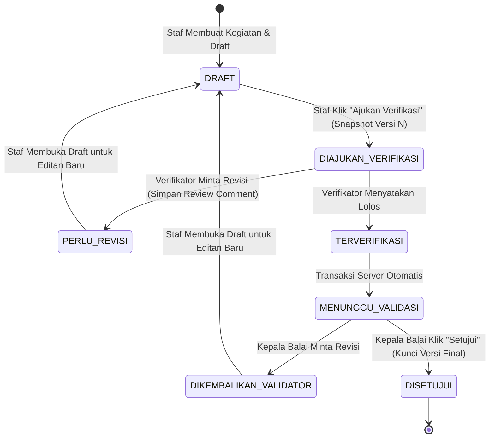

# Kontrak Domain & Spesifikasi Arsitektur SI-PD BPHL XI (Tahap 1)

**Versi:** 1.0  
**Status:** Draf Teknis Terverifikasi (Tahap 1)  
**Tanggal:** 25 September 2026  

---

## 1. Spesifikasi Entitas Domain

```
[Surat Tugas (assignments)] ── (1:N) ──> [Kegiatan (activities)] ── (1:N) ──> [Anggota & Verifikator (activity_members / reviewer_assignments)]
                                                 │
                                               (1:1)
                                                 ▼
[Telaahan Staf (staff_studies)] <── (0:1) ── [Laporan (reports)] ── (1:N) ──> [Versi Laporan (report_versions)]
                                                 │                                   │
                                               (1:N)                               (1:N)
                                                 ▼                                   ▼
                                     [Lampiran (attachments)]             [Komentar Review (review_comments)]
```

### 1.1 Entitas Induk: Surat Tugas (`assignments`)
- **Tujuan:** Menyimpan dokumen resmi Surat Tugas pendorong kegiatan.
- **Atribut Utama:** `id` (UUID), `nomor_st` (VARCHAR, Unique), `tanggal_st` (DATE), `file_st_id` (UUID FK ke `attachments`), `pemberi_tugas_nama` (VARCHAR), `pemberi_tugas_jabatan` (VARCHAR), `created_at`, `updated_at`.

### 1.2 Entitas Utama: Kegiatan (`activities`)
- **Tujuan:** Entitas induk pekerjaan lapangan yang menghubungkan ST, tim, objek, instrumen, dan laporan.
- **Atribut Utama:** `id` (UUID), `assignment_id` (UUID FK ke `assignments`), `jenis_kegiatan_id` (VARCHAR), `nama_kegiatan` (TEXT), `pelaku_usaha_id` (VARCHAR), `lokasi` (TEXT), `tanggal_mulai` (DATE), `tanggal_selesai` (DATE), `status` (`DRAFT`, `BERJALAN`, `MENUNGGU_LAPORAN`, `SELESAI`, `DIBATALKAN`), `created_by` (UUID FK ke `users`), `created_at`, `updated_at`.

### 1.3 Entitas Penugasan Tim & Verifikator (`activity_members`, `reviewer_assignments`)
- **`activity_members`:** `id`, `activity_id` (UUID FK), `user_id` (UUID FK), `peran_dalam_tim` (`KETUA`, `ANGGOTA`), `created_at`. Unique (`activity_id`, `user_id`).
- **`reviewer_assignments`:** `id`, `activity_id` (UUID FK), `reviewer_user_id` (UUID FK), `ditugaskan_oleh` (UUID FK), `created_at`. Unique (`activity_id`, `reviewer_user_id`).

### 1.4 Entitas Laporan (`reports`)
- **Tujuan:** Dokumen hasil pekerjaan kegiatan.
- **Atribut Utama:** `id` (UUID), `activity_id` (UUID FK ke `activities`, Unique 1-to-1), `current_version_id` (UUID FK ke `report_versions`, Nullable), `status` (`DRAFT`, `DIAJUKAN_VERIFIKASI`, `PERLU_REVISI`, `TERVERIFIKASI`, `MENUNGGU_VALIDASI`, `DIKEMBALIKAN_VALIDATOR`, `DISETUJUI`, `DIBATALKAN`), `created_by` (UUID FK ke `users`), `created_at`, `updated_at`.

### 1.5 Entitas Versi Laporan (`report_versions`)
- **Tujuan:** Snapshot tak-dapat-diubah (*immutable snapshot*) dari setiap revisi laporan.
- **Atribut Utama:** `id` (UUID), `report_id` (UUID FK ke `reports`), `version_number` (INT), `judul_laporan` (TEXT), `maksud_tujuan` (TEXT), `hasil_kegiatan` (TEXT/JSONB), `kesimpulan` (TEXT), `saran` (TEXT), `snapshot_data_json` (JSONB), `content_hash` (VARCHAR), `created_by` (UUID FK ke `users`), `created_at`. Unique (`report_id`, `version_number`).

### 1.6 Entitas Komentar & Catatan Review (`review_comments`)
- **Tujuan:** Catatan revisi dan pemeriksaan verifikator/validator (*append-only*).
- **Atribut Utama:** `id` (UUID), `report_version_id` (UUID FK ke `report_versions`), `author_id` (UUID FK ke `users`), `action` (`REVISION_REQUESTED`, `VERIFIED`, `VALIDATION_RETURNED`, `APPROVED`), `comment_text` (TEXT), `created_at`.

### 1.7 Entitas Lampiran File (`attachments`)
- **Tujuan:** Metadata berkas fisik yang disimpan di storage privat terkontrol.
- **Atribut Utama:** `id` (UUID), `activity_id` (UUID FK ke `activities`, Nullable), `report_id` (UUID FK ke `reports`, Nullable), `file_name` (VARCHAR), `mime_type` (VARCHAR), `file_size_bytes` (BIGINT), `provider` (`LOCAL_PRIVATE`, `GDRIVE_SHARED`, `EXTERNAL_LEGACY`), `file_id_ref` (TEXT), `uploaded_by` (UUID FK ke `users`), `created_at`.

### 1.8 Entitas Telaahan Staf (`staff_studies`)
- **Tujuan:** Naskah telaahan opsional yang **wajib mengunci** pada laporan yang telah disetujui (`DISETUJUI`).
- **Atribut Utama:** `id` (UUID), `approved_report_version_id` (UUID FK ke `report_versions`), `judul` (TEXT), `persoalan` (TEXT), `praanggapan` (TEXT), `fakta` (TEXT), `analisis` (TEXT), `kesimpulan` (TEXT), `saran` (TEXT), `tanggal_telaahan` (DATE), `status` (`DRAFT`, `DIAJUKAN`, `DISETUJUI`), `created_by` (UUID FK ke `users`), `created_at`, `updated_at`.

---

## 2. Matriks Izin Akses per Objek & Otorisasi Server (RBAC Matrix)

| Aksi / Fungsi | Staf Pembuat (Member) | Verifikator Tertugas | Kepala Balai (Validator) | Admin Sistem |
|---|:---:|:---:|:---:|:---:|
| **Buat Kegiatan & Upload ST** | **YA** | TIDAK | TIDAK | **YA** |
| **Lihat Kegiatan & Laporan** | Hanya yang ditugaskan | Hanya yang ditugaskan | **YA** (Semua) | **YA** (Support/Audit) |
| **Edit Draft Laporan** | **YA** (hanya status `DRAFT`) | TIDAK | TIDAK | TIDAK |
| **Ajukan Laporan ke Verifikator** | **YA** (status `DRAFT`) | TIDAK | TIDAK | TIDAK |
| **Minta Revisi (Kembalikan)** | TIDAK | **YA** (status `DIAJUKAN_VERIFIKASI`) | **YA** (status `TERVERIFIKASI` / `MENUNGGU_VALIDASI`) | TIDAK |
| **Loloskan Verifikasi** | TIDAK | **YA** (status `DIAJUKAN_VERIFIKASI`)* | TIDAK | TIDAK |
| **Setujui (Approve) Laporan Final** | TIDAK | TIDAK | **YA** (status `MENUNGGU_VALIDASI`) | TIDAK |
| **Buat Telaahan Staf** | **YA** (hanya jika `report.status == DISETUJUI`) | **YA** (jika ditugaskan) | Lihat saja | TIDAK |
| **Unduh Lampiran File Privat** | Hanya jika punya akses kegiatan | Hanya jika punya akses kegiatan | **YA** | **YA** (Terlog) |
| **Panggil Prompt AI Draft** | **YA** (hanya data kegiatan sendiri) | TIDAK | TIDAK | TIDAK |

> **⚠️ Aturan Penugasan Mandiri (Self-Review Guard):** Server menolak secara mutlak jika `created_by == reviewer_user_id`. Jika verifikator bertindak sebagai pembuat, kegiatan **wajib** memiliki verifikator penanggung jawab kedua yang ditugaskan.

---

## 3. State Machine Laporan & Rules Transisi Status



### Aturan Transisi Ketat:
1. **Pengajuan (Submit):** Mengubah status laporan menjadi `DIAJUKAN_VERIFIKASI`, menaikkan `version_number` +1, dan membekukan `report_versions` snapshot.
2. **Revisi (Return):** Mencatat `review_comments` baru (append-only) yang menunjuk ke `report_version_id`. Status berubah menjadi `PERLU_REVISI` / `DIKEMBALIKAN_VALIDATOR`.
3. **Pengesahan (Approve):** Menyimpan timestamp server, identitas Kepala Balai, checksum `content_hash`, dan mengunci `current_version_id`.
4. **Prasyarat Telaahan Staf:** API `POST /api/staff-studies` mengecek `reports.status == 'DISETUJUI'`. Jika bukan `DISETUJUI`, server langsung mengembalikan respon `400 Bad Request`.

---

## 4. Penyempurnaan Rencana Teknis Tahap Berikutnya

Sesuai 4 ketentuan revisi teknis:
1. **Verifikasi Migrasi Data:** Tidak menggunakan klaim "checksum data identik" untuk data hasil transformasi skema (karena representasi struktur JSON lama beda dengan tabel PostgreSQL baru). Verifikasi migrasi dilakukan dengan **rekonsiliasi jumlah record (row-count parity), pemetaan foreign key acuan, serta validasi kelengkapan bidang wajib (*non-null constraint check*)**.
2. **Backup Final menjelang Cutover:** Backup final `db_store.json` dilakukan tepat pada jeda waktu *maintenance window* beberapa menit sebelum proses cutover database produksi dijalankan.
3. **Rollback Aman tanpa Melemahkan Keamanan:** Prosedur rollback **DILARAANG KERAS** mengembalikan sistem ke otorisasi API key lama yang terbuka atau tanpa enkripsi. Rollback teknis tetap **menjaga sistem autentikasi terenkripsi & otorisasi server ketat** yang telah dibangun.
4. **Log Delta & Rekonsiliasi Transaksi:** Setiap transaksi tulis (writes) yang terjadi setelah backup final dilakukan wajib dicatat dalam *write-ahead delta log* untuk di-rekonsiliasi secara penuh sehingga tidak ada data pengguna yang tercecer.
